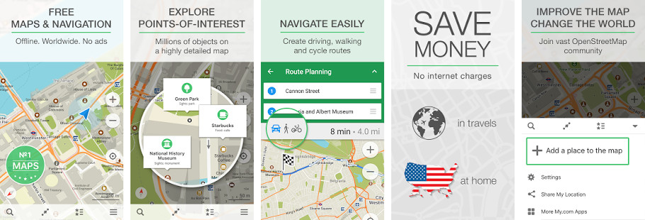

# MAPS.ME

[MAPS.ME](https://maps.me) is an open source cross-platform offline maps application,
built on top of crowd-sourced OpenStreetMap data. It was publicly released
for [iOS](https://itunes.apple.com/app/id510623322) and
[Android](https://play.google.com/store/apps/details?id=com.mapswithme.maps.pro).

## Submodules

This repository contains submodules. Clone it with `git clone --recursive`. If you forgot,
run `git submodule update --init --recursive`.

## Translations

If you want to improve app translations or add more search synonyms, please check our [wiki](https://github.com/mapsme/omim/wiki).

## Compilation

To compile the project, you would need to initialize private key files. Run
`configure.sh` and press Enter to create empty files, good enough to build desktop
and Android debug packages.

For detailed installation instructions and Android/iOS building process,
see [INSTALL.md](https://github.com/mapsme/omim/tree/master/docs/INSTALL.md).

## Building maps

To create one or many map files, first build the project, then use python module [maps_generator](https://github.com/mapsme/omim/tree/master/tools/python/maps_generator).

## Map styles

MAPS.ME uses its own binary format for map styles, `drules_proto.bin`, which is compiled from
[MapCSS](https://wiki.openstreetmap.org/wiki/MapCSS) using modified Kothic library.
Feature set in MWM files depends on a compiled style, so make sure to rebuild maps after
releasing a style.

For development, use MAPS.ME Designer app along with its generator tool: these allow
for quick rebuilding of a style and symbols, and for producing a zoom-independent
feature set in MWM files.

See [STYLES.md](https://github.com/mapsme/omim/tree/master/docs/STYLES.md) for the
format description, instructions on building a style and some links.

## Development

You would need Qt 5 for development, most other libraries are included into the
repository: see `3party` directory. The team uses mostly XCode and Qt Creator,
though these are not mandatory. We have an established
[c++ coding style](https://github.com/mapsme/omim/blob/master/docs/CPP_STYLE.md) and [Objective-C coding style](https://github.com/mapsme/omim/blob/master/docs/OBJC_STYLE.md).

**You can turn on experimental public transport support.** For details please read [simple instruction.](https://github.com/mapsme/omim/blob/master/docs/EXPERIMENTAL_PUBLIC_TRANSPORT_SUPPORT.md)

See [CONTRIBUTING.md](https://github.com/mapsme/omim/blob/master/docs/CONTRIBUTING.md)
for the repository initialization process, the description of all the directories
of this repository and other development-related information.

All contributors must sign a [Contributor Agreement](https://github.com/mapsme/omim/blob/master/docs/CLA.md),
so both our and their rights are protected.

## Feedback

Please report bugs and suggestions to [the issue tracker](https://github.com/mapsme/omim/issues),
or by mail to bugs@maps.me.

## Authors and License

This source code is Copyright (C) 2020 My.com B.V. (Mail.Ru Group), published under Apache Public License 2.0,
except third-party libraries. See [NOTICE](https://github.com/mapsme/omim/blob/master/NOTICE)
and [data/copyright.html](http://htmlpreview.github.io/?https://github.com/mapsme/omim/blob/master/data/copyright.html) files for more information.
