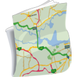
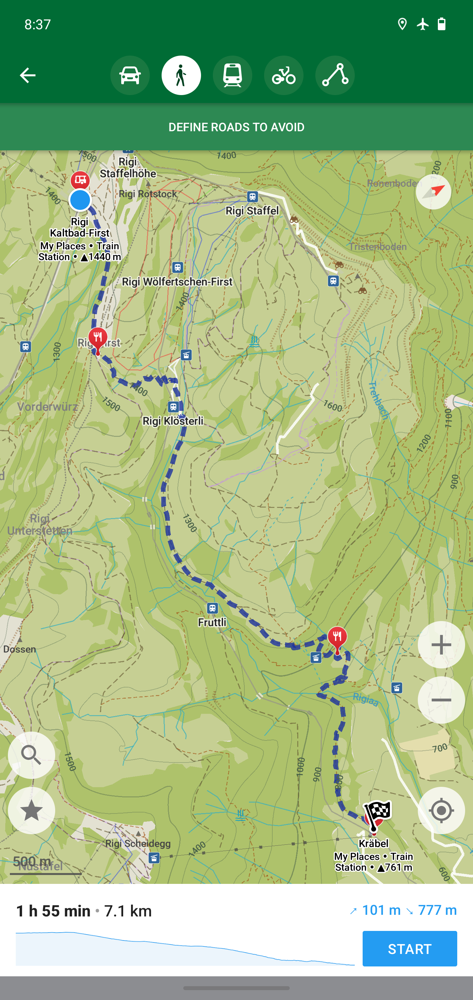
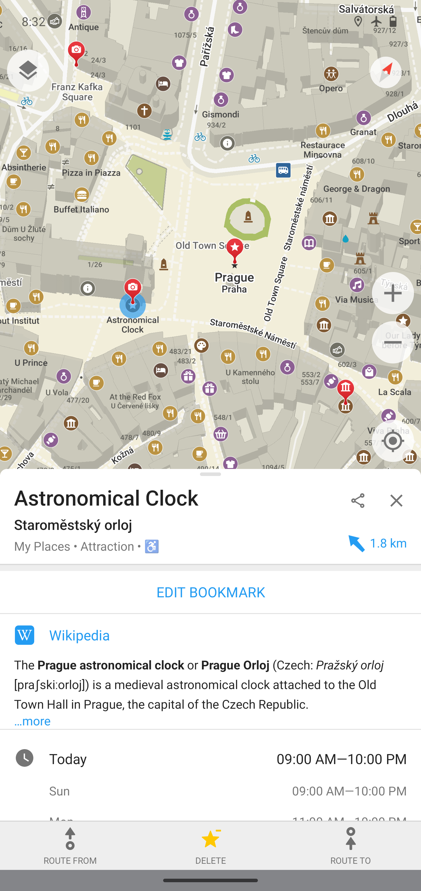
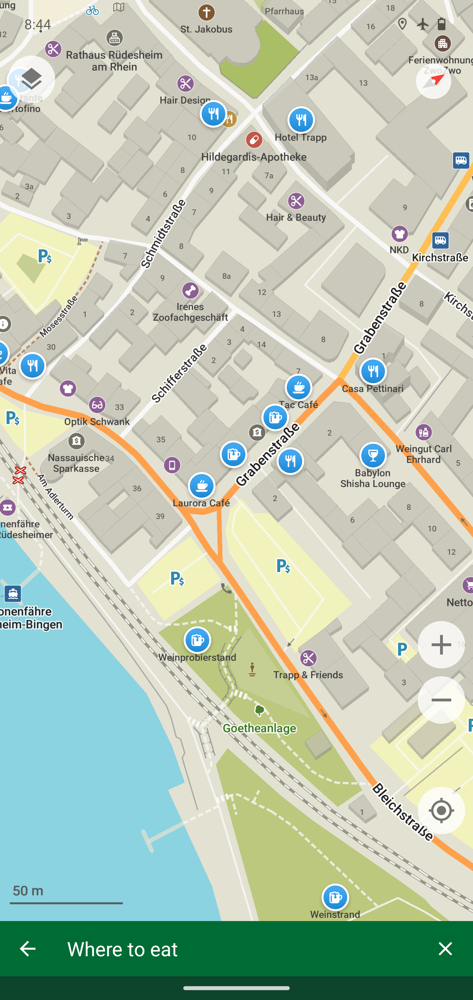
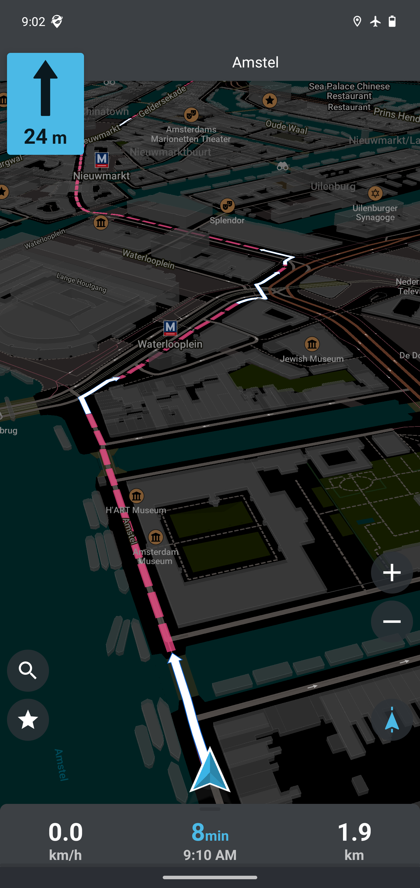
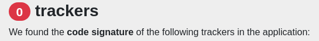
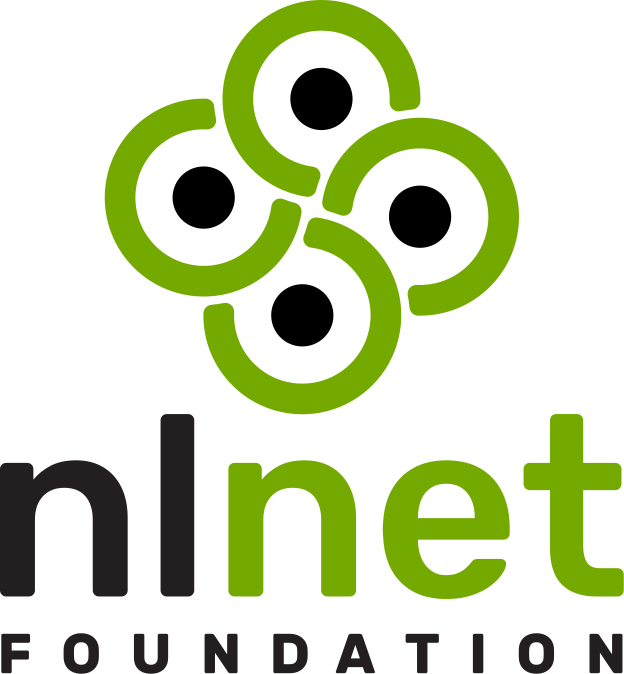

  

<h1 align="center">Organic Maps</h1>

**Organic Maps** is a privacy-first offline maps & GPS app for hiking, cycling, biking, and driving. Absolutely free. No ads. No tracking. Developed with love by the open-source community. Powered by [OpenStreetMap](https://www.openstreetmap.org) data.

  
  
  
  

## Features

Organic Maps is the ultimate companion app for travellers, tourists, hikers, and cyclists:

- Detailed offline maps with places that don't exist on other maps, thanks to [OpenStreetMap](https://openstreetmap.org)
- Cycling routes, hiking trails, and walking paths
- Contour lines, elevation profiles, peaks, and slopes
- Turn-by-turn walking, cycling, and car navigation with voice guidance
- Fast offline search on the map
- Bookmarks and tracks import and export in KML, KMZ & GPX formats
- Dark Mode to protect your eyes
- Countries and regions don't take a lot of space
- Free and open-source

## Why Organic?

Organic Maps is pure and organic, made with love:

- Respects your privacy
- Saves your battery
- No unexpected mobile data charges

Organic Maps is free from trackers and other bad stuff:

- No ads
- No tracking
- No data collection
- No phoning home
- No annoying registration
- No mandatory tutorials
- No noisy email spam
- No push notifications
- No crapware
- ~~No pesticides~~ Purely organic!

The Android application is verified by the <a href="https://reports.exodus-privacy.eu.org/en/reports/app.organicmaps/latest/">Exodus Privacy Project:

</a>

The iOS application is verified by <a href="https://ios.trackercontrol.org/analysis/app.organicmaps">TrackerControl for iOS:

</a>

 

Organic Maps doesn't request excessive permissions to spy on you:

  
  

At Organic Maps, we believe that privacy is a fundamental human right:

- Organic Maps is an indie community-driven open-source project
- We protect your privacy from Big Tech's prying eyes
- Stay safe no matter where you are

Reject surveillance - embrace your freedom.

[**Give Organic Maps a try!**](#install)

## Who is paying for the development?

The app is free for everyone, so we rely on donations. Please donate at [organicmaps.app/donate](https://organicmaps.app/donate) to support us!

Beloved institutional sponsors below have provided targeted grants to cover some infrastructure costs and fund development of new selected features:

<table>
  <tr>
    <td>
      
    </td>
    <td>
      <a href="https://github.com/organicmaps/organicmaps/milestone/7">The Search & Fonts improvement project</a> has been <a href="https://nlnet.nl/project/OrganicMaps/">funded</a> through NGI0 Entrust Fund. <a href="https://nlnet.nl/entrust/">NGI0 Entrust Fund</a> is established by the <a href="https://nlnet.nl/">NLnet Foundation</a> with financial support from the European Commission's <a href="https://www.ngi.eu/">Next Generation Internet programme</a>, under the aegis of DG Communications Networks, Content and Technology under grant agreement No 101069594.
    </td>
  </tr>
  <tr>
    <td>
      
    </td>
    <td>
      <a href="https://summerofcode.withgoogle.com/">Google</a> backed 5 student's projects in the Google Summer of Code program during <a href="https://summerofcode.withgoogle.com/programs/2022/organizations/organic-maps">2022</a> and <a href="https://summerofcode.withgoogle.com/programs/2023/organizations/organic-maps">2023</a> programs. Noteworthy projects included Android Auto and Wikipedia Dump Extractor.
    </td>
  </tr>
  <tr>
    <td>
      
    </td>
    <td>
      <a href="https://www.mythic-beasts.com/">Mythic Beasts</a> ISP <a href="https://www.mythic-beasts.com/blog/2021/10/06/improving-the-world-bit-by-expensive-bit/">provides us</a> two virtual servers with 400 TB/month of free bandwidth to host and serve maps downloads and updates.
    </td>
  </tr>
  <tr>
    <td>
      
    </td>
    <td>
      <a href="https://44plus.vn">44+ Technologies</a> is <a href="https://44plus.vn/organicmaps">providing us </a>with a free dedicated server worth around $12,000/year to serve maps across Vietnam & Southeast Asia.
    </td>
  </tr>
  <tr>
    <td>
      
    </td>
    <td>
      <a href="https://futo.org">FUTO</a> has <a href="https://www.youtube.com/watch?v=fJJclgBHrEw">awarded $1000 micro-grant</a> to Organic Maps in February 2023.
    </td>
  </tr>
</table>

The majority of all expenses have been funded by founders of the project since its inception. The project is far from achieving any sort of financial sustainability. The current level of voluntary donations falls significantly short of covering efforts needed to sustain the app. Any new developments of features are beyond the scope of possibility due to the absence of the necessary financial resources.

Please consider [donating](https://organicmaps.app/donate) if you want to see this open-source project thriving, not dying. There are [other ways how to support the project](#contributing). No coding skills required.

## Copyrights

Licensed under the Apache License, Version 2.0. See
[LICENSE](https://github.com/organicmaps/organicmaps/blob/master/LICENSE),
[NOTICE](https://github.com/organicmaps/organicmaps/blob/master/NOTICE),
[data/copyright.html](http://htmlpreview.github.io/?https://github.com/organicmaps/organicmaps/blob/master/data/copyright.html) and [.reuse/dep5](https://github.com/organicmaps/organicmaps/blob/master/.reuse/dep5),
for more information.

## Governance

See [docs/GOVERNANCE.md](docs/GOVERNANCE.md).

<a name="contributing">

## Contributing

If you want to build the project, check [docs/INSTALL.md](docs/INSTALL.md). If you want to help the project,
see [docs/CONTRIBUTING.md](docs/CONTRIBUTING.md). You can [help in many ways](https://organicmaps.app/support-us/), the ability to code is not necessary.

## Beta

Please join our beta program, suggest your features, and report bugs:

- [iOS Beta (TestFlight)](https://testflight.apple.com/join/lrKCl08I)
- [Android Beta (Firebase)](https://appdistribution.firebase.dev/i/f3e918f9abc40c9c)

## Feedback

- **Rate us on the [App Store](https://apps.apple.com/app/organic-maps/id1567437057)
and [Google Play](https://play.google.com/store/apps/details?id=app.organicmaps)**.
- **Star us on Github**.
- Report bugs or issues to [the issue tracker](https://github.com/organicmaps/organicmaps/issues).
- Subscribe to our [Telegram Channel](https://t.me/OrganicMapsApp) or to the [[matrix] space](https://matrix.to/#/#organicmaps:matrix.org) for updates.
- Join our [Telegram Group](https://t.me/OrganicMaps) to discuss with other users.
  - Присоединяйтесь к нашей [русскоязычной группе в Telegram](https://t.me/OrganicMapsRu) для обратной связи и помощи.
  - Diğer kullanıcılarla tartışmak için [Telegram Grubumuza](https://t.me/OrganicMapsTR) katılın.
  - Rejoignez notre groupe [Telegram](https://t.me/OrganicMapsFR) pour obtenir de l'aide.
- Contact us by [email](mailto:hello@organicmaps.app).
- Follow our updates in
[Mastodon](https://fosstodon.org/@organicmaps),
[Facebook](https://facebook.com/OrganicMaps),
[X (Twitter)](https://x.com/OrganicMapsApp),
[Instagram](https://instagram.com/organicmaps.app/).
  - Güncellemelerimizi [Instagram](https://instagram.com/organicmapstr/) üzerinden takip edin.

The Organic Maps community abides by the CNCF [code of conduct](https://github.com/organicmaps/organicmaps/blob/master/docs/CODE_OF_CONDUCT.md).

## License

Organic Maps is licensed under the [Apache License 2.0](LICENSE).

Binary map data files (`.mwm`) are provided under a separate license.
See `DATA_LICENSE.txt` for details.

### Attribution for forks and derivative apps based on Organic Maps

If you use Organic Maps source code or its user interface in your project, please include a visible, human-readable mention of the “Organic Maps Project” and a clickable link to https://organicmaps.app. To respect the work of all project contributors and to comply with license attribution terms, this notice should appear in user-visible locations, such as the product’s “About” and “Main Menu” screens.

### 🤝 White-label

For inquiries about white-labeling or using our servers for your products, please contact us in advance at:

**legal@organicmaps.app**

Thank you!
