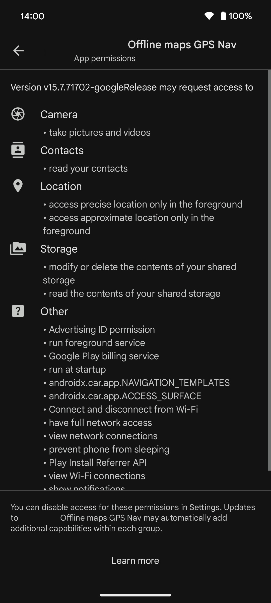

# Organic Maps

<a name="install"/>

[Organic Maps](https://organicmaps.app) is a free Android & iOS offline maps app for travelers, tourists, hikers, and cyclists. It uses crowd-sourced OpenStreetMap data and is developed with love by **MapsWithMe** (**MapsMe**) founders and our community. No ads, no tracking, no data collection, no crapware. Your [donations](https://organicmaps.app/donate/) and positive reviews motivate and inspire us, thanks ❤️!

  
  
  
  
  
  

  
  
  
  

## Features

Organic Maps is the ultimate companion app for travelers, tourists, hikers, and cyclists:

- Detailed offline maps with places that don't exist on other maps, thanks to [OpenStreetMap](https://osm.org)
- Cycling routes, hiking trails, and walking paths
- Contour lines, elevation profiles, peaks, and slopes
- Turn-by-turn walking, cycling, and car navigation with voice guidance
- Fast offline search on the map
- Bookmarks export and import in KML/KMZ formats (GPX is [planned](https://github.com/organicmaps/organicmaps/issues/624))
- Dark Mode to protect your eyes
- Countries and regions don't take a lot of space
- Free and open-source

## Why Organic?

Organic Maps is pure and organic, made with love:

- Respects your privacy
- Saves your battery
- No unexpected mobile data charges

Organic Maps app is free from trackers and other bad stuff:

- No ads
- No tracking
- No data collection
- No phoning home
- No annoying registration
- No mandatory tutorials
- No noisy email spam
- No push notifications
- No crapware
- ~~No pesticides~~ Purely organic!

The application is verified by <a href="https://reports.exodus-privacy.eu.org/en/reports/app.organicmaps/latest/">Exodus Privacy Project:

</a>

 

Organic Maps doesn't request excessive permissions to spy on you:

  
  

At Organic Maps, we believe that privacy is a fundamental human right:

- Organic Maps is an indie community-driven open-source project
- We protect your privacy from Big Tech's prying eyes
- Stay safe no matter wherever you are

Reject surveillance - embrace your freedom.

[**Give Organic Maps a try!**](#install)

## Who is paying for the free app?

The app is free for everyone. Please [donate](https://organicmaps.app/donate) to support us!

### Our sponsors

[Mythic Beasts](https://www.mythic-beasts.com/) ISP [provides us](https://www.mythic-beasts.com/blog/2021/10/06/improving-the-world-bit-by-expensive-bit/)
two virtual servers with 400 TB/month of free bandwidth to help our users with
maps downloads and updates.

## Copyrights

Licensed under the Apache License, Version 2.0. See
[LICENSE](https://github.com/organicmaps/organicmaps/blob/master/LICENSE),
[NOTICE](https://github.com/organicmaps/organicmaps/blob/master/NOTICE)
and [data/copyright.html](http://htmlpreview.github.io/?https://github.com/organicmaps/organicmaps/blob/master/data/copyright.html)
files for more information.

## Governance

See [GOVERNANCE](docs/GOVERNANCE.md).

## Contributing

See [CONTRIBUTING](docs/CONTRIBUTING.md) and read everything in the [docs folder](docs/) of the repository.

## Beta

Please join our beta program, suggest your features, and report bugs:

- [iOS Beta (TestFlight)](https://testflight.apple.com/join/lrKCl08I)
- [Android Beta (Firebase)](https://appdistribution.firebase.dev/i/9ec3bca5e2b47373)

## Feedback

- **Rate us on [App Store](https://apps.apple.com/app/organic-maps/id1567437057)
and [Google Play](https://play.google.com/store/apps/details?id=app.organicmaps)**.
- **Star us on GitHub**.
- Report bugs or issues to [the issue tracker](https://github.com/organicmaps/organicmaps/issues).
- [Discuss](https://github.com/organicmaps/organicmaps/discussions/categories/ideas) ideas or propose feature requests.
- Subscribe to our [Telegram Channel](https://t.me/OrganicMapsApp) or to the [[matrix] space](https://matrix.to/#/#organicmaps:matrix.org) for updates.
- Join our [Telegram Group](https://t.me/OrganicMaps) to discuss with other users.
  - Присоединяйтесь к нашей [русскоязычной группе в Telegram](https://t.me/OrganicMapsRu) для обратной связи и помощи.
  - Diğer kullanıcılarla tartışmak için [Telegram Grubumuza](https://t.me/OrganicMapsTR) katılın.
- Contact us by [email](mailto:hello@organicmaps.app).
- Follow our updates in [Facebook](https://facebook.com/OrganicMaps), [Twitter](https://twitter.com/OrganicMapsApp),
[Instagram](https://instagram.com/organicmaps.app/).
  - Güncellemelerimizi [Instagram](https://instagram.com/organicmapstr/) üzerinden takip edin.

The Organic Maps community abides by the CNCF code of conduct.
